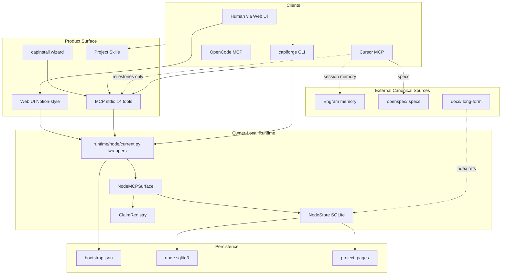

# CapiForge v0.3 — Architecture and Product Direction

## Purpose

CapiForge is a **local-first project documentation and task hub** for a single owner running multiple AI agents on the same adopted repository. It keeps **purpose**, **architecture**, **audits**, and **task state** current in SQLite with a Notion-style web UI as the primary human surface.

CapiForge is **not** a replacement for Engram (agent session memory) or OpenSpec (specs). Agents publish to CapiForge **only at milestones** to limit token use.

## High-Level Architecture



## Hybrid truth model

| Content | Canonical in | CapiForge |
| --- | --- | --- |
| Purpose, architecture | `project_pages` table | Editable via web UI; agents update at milestones |
| Audits | `audits` table | `audit_create_brief` → `audit_publish` at milestones |
| Tasks | `tasks` table | Milestone creation; UI for human tracking |
| Specs | `openspec/` | Link via `artifact_refs`; do not duplicate |
| Agent memory | Engram | Out of scope; never duplicate |
| Long-form docs | `docs/` in repo | `local_documents` path index |

## Agent publication model

### Default: milestones only

Agents MUST NOT run pickup → start → close on every micro-task. Use Engram for session persistence and CapiForge only when:

- An audit or review is completed
- A significant feature or change is closed
- Architecture documentation changes

### Optional: queue-assigned work

When work is explicitly assigned from the CapiForge ready queue, use Path A (claims + transitions). See [mvp.md](mvp.md) for the v0.2 coordination checklist.

### Path A — Queue pickup

```
current_get → tasks_ready_get → tasks_claim → tasks_transition(in_progress)
→ work → tasks_transition(done|blocked)
```

### Path B — Lifecycle reconcile (milestones / new work)

```
audit_create_brief → audit_publish → tasks_reconcile_start(lifecycle_key)
→ work → tasks_reconcile_finish
```

## MCP Surface

| Category | Tools |
| --- | --- |
| Reads | `workspace_get_current`, `project_entrypoint_get`, `tasks_list_by_index`, `sync_status`, `current_get`, `tasks_ready_get` |
| Claims | `tasks_claim`, `tasks_claim_renew`, `tasks_release` |
| Mutations | `tasks_transition`, `tasks_reconcile_start`, `tasks_reconcile_finish` |
| Audits | `audit_create_brief`, `audit_publish` |

Session identity is derived per MCP client (`clientInfo`) or overridden with `CAPIFORGE_SESSION_ID`.

## Installed Skills

| Skill | Role |
| --- | --- |
| `capiforge-publish-milestone` | **Primary** — when and how agents publish at milestones |
| `capiforge-data-layer` | SQLite contract and hybrid truth boundaries |
| `capiforge-pickup-task` | Optional — claim from ready queue when assigned |
| `capiforge-start-task` | Optional — start claimed queue task |
| `capiforge-close-task` | Optional — close claimed queue task |
| `capiforge-record-completed-work` | OpenCode milestone lifecycle automation |

## Current State (2026-06-21)

| Area | Status |
| --- | --- |
| Coordination MVP v0.2 | Complete |
| Scope pivot audit v0.3 | Published |
| `project_pages` schema | v0.3 — purpose, architecture |
| Web UI hub | Purpose/architecture on home; markdown editor |
| Multi-user / sync / BI | Future — coordinator exists but frozen for MVP |

## Audits

- v0.1 coordination: [audit-v01-agent-coordination.md](audits/audit-v01-agent-coordination.md)
- v0.2 MVP status: [audit-v02-mvp-status.md](audits/audit-v02-mvp-status.md)
- v0.3 scope pivot: [audit-v03-scope-pivot.md](audits/audit-v03-scope-pivot.md)

## Getting Started

```bash
./capinstall install --cursor --opencode --non-interactive
capiforge web
capiforge current
```

Load `AGENTS.md` and `capiforge-publish-milestone` before agent work. Use [mvp-v03.md](mvp-v03.md) to verify MVP v0.3 readiness.

## Future vision (post-MVP)

- Multi-user workspaces with invitations
- LAN coordinator sync for multi-machine owners
- Admin dashboards and BI across projects
- Developer onboarding from the live project hub

Coordinator LAN code remains in-tree but is not required for MVP v0.3.
