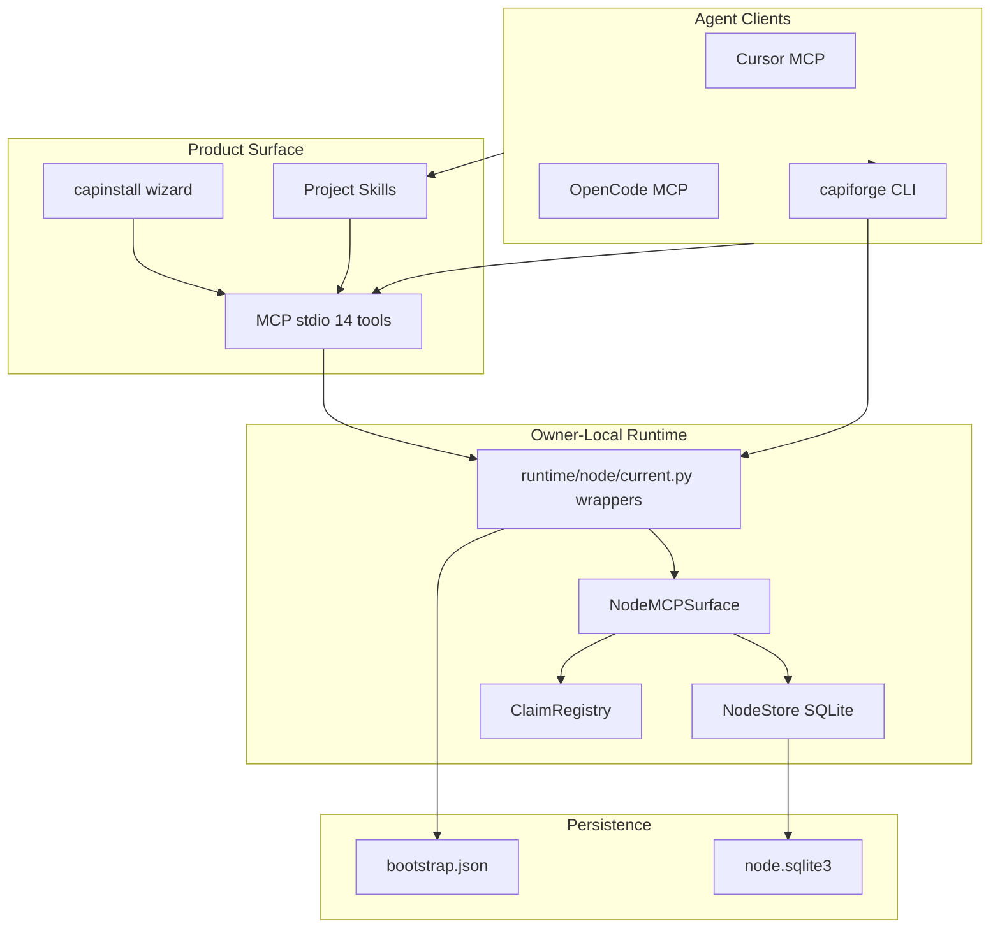

# CapiForge v0.1 — Architecture and Current State

## Purpose

CapiForge is a local-first runtime that lets multiple AI agents coordinate on the same adopted repository through audits, tasks, exclusive claims, and a deterministic MCP/CLI surface.

## High-Level Architecture



## V1.1 Bootstrap Path

1. `./capinstall install --cursor --opencode` installs the binary, bootstraps `init` → `adopt`, registers MCP, and copies automation skills.
2. Adopted repo state lives under `.capiforge/node/`.
3. Canonical writes stay on the owner node; the LAN coordinator remains optional and non-authoritative.

## Agent Coordination Model

### Path A — Queue pickup (existing ready tasks)

```
current_get → tasks_ready_get → tasks_claim → tasks_transition(in_progress)
→ work → tasks_transition(done|blocked) → optional tasks_claim_renew during work
```

### Path B — Lifecycle reconcile (new justified work)

```
audit_create_brief → audit_publish → tasks_reconcile_start(lifecycle_key)
→ work → tasks_reconcile_finish
```

Use Path B when the work item does not exist yet or must be keyed by `lifecycle_key`.

## MCP Surface (v0.1)

| Category | Tools |
| --- | --- |
| Reads | `workspace_get_current`, `project_entrypoint_get`, `tasks_list_by_index`, `sync_status`, `current_get`, `tasks_ready_get` |
| Claims | `tasks_claim`, `tasks_claim_renew`, `tasks_release` |
| Mutations | `tasks_transition`, `tasks_reconcile_start`, `tasks_reconcile_finish` |
| Audits | `audit_create_brief`, `audit_publish` |

Session identity is derived per MCP client (`clientInfo`) or overridden with `CAPIFORGE_SESSION_ID`.

## Installed Skills

| Skill | Role |
| --- | --- |
| `capiforge-pickup-task` | Select and claim a ready task |
| `capiforge-start-task` | Move a claimed task to `in_progress` |
| `capiforge-close-task` | Close a task with required metadata |
| `capiforge-data-layer` | Explain DB layout and update rules |
| `capiforge-record-completed-work` | OpenCode lifecycle automation contract |

## Current State (2026-06-19 audit)

| Area | Status |
| --- | --- |
| Domain model + schema | Beta-ready |
| MCP pickup/start/close | Implemented via `tasks_transition` |
| Lifecycle reconcile | Implemented and tested |
| Install automation | OpenCode + Cursor skill delivery via `capinstall` |
| Multi-agent isolation | Per-client MCP session IDs; lease renewal exposed |
| Coordinator LAN | Implemented but not required for owner-local V1.1 |

## First Audit

The v0.1 coordination audit is published as `aud_5fb52505c5d5563e` with seven derived ready tasks keyed under `audit/v0.1/*`. See [audit-v01-agent-coordination.md](audits/audit-v01-agent-coordination.md).

## Getting Started

```bash
./capinstall install --cursor --opencode --non-interactive
capiforge current
capiforge tasks ready
```

Load `AGENTS.md` and the relevant skill before coordinating work. Use `skills/capiforge-data-layer/SKILL.md` when you need persistence semantics. Use [docs/mvp.md](mvp.md) to verify MVP readiness.

## Multi-agent notes

- MCP assigns a distinct `session_id` per client (`clientInfo` hash).
- Renew long claims with `tasks_claim_renew` every 3–4 minutes (default lease: 5 minutes).
- Only one active claim per task; a second session receives `CLAIM_CONFLICT`.
