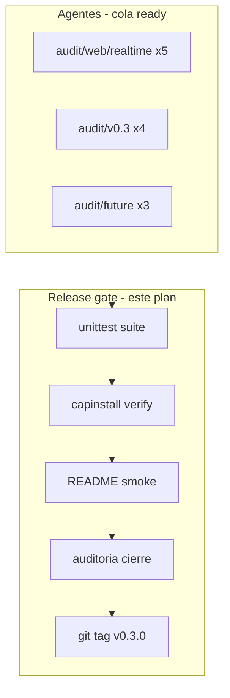

# Auditoría: CapiForge v0.3 — Cierre MVP, verificación y release

**Fecha:** 2026-06-21  
**Reemplaza / actualiza:** planificación de `aud_520ca02978e35b95` (scope pivot) para la fase de **cierre y release**  
**Alcance:** verificación completa, tests, instalador, README, tag git `v0.3.0`  
**Objetivo:** declarar MVP v0.3 cerrado y listo para arrancar siguiendo solo [README.md](../../README.md)

> Documento de pivot original (referencia): [audit-v03-scope-pivot.md](audit-v03-scope-pivot.md)

## Resumen ejecutivo

El hub documental v0.3 está en implementación (11/15 tareas pivot `done`, cola con realtime + remanentes v0.3). **Esta auditoría** define el gate de cierre: producto + release engineering + tag `v0.3.0`.

**Decisiones confirmadas:**

- Fuente de verdad híbrida: propósito, arquitectura y tareas en CapiForge; Engram + OpenSpec fuera de scope.
- Agentes publican solo en hitos; nosotros ejecutamos verificación completa y release.
- `audit/future/*` queda fuera del release v0.3.

---

## Situación actual



| Métrica | Valor |
|---------|-------|
| Tareas v0.3 pivot `done` | 11 / 15 |
| Cola `ready` | ~13 (realtime + v0.3 + future) |
| `capiforge --version` | `0.1.0` → bump a `0.3.0` |
| Schema | `user_version=2` |
| MCP | Operativo post-restart |

---

## Criterios de cierre MVP v0.3

### Producto ([mvp-v03.md](../mvp-v03.md))

| # | Criterio |
|---|----------|
| P1 | `capiforge web`: propósito, arquitectura, tareas, auditorías |
| P2 | Edición humana de `project_pages` |
| P3 | Skill `capiforge-publish-milestone` vía `capinstall` |
| P4 | Regresión MCP v0.2 (pickup/reconcile) |

### Release

| # | Criterio |
|---|----------|
| R1 | `python3 -m unittest discover -s tests` verde |
| R2 | `./capinstall verify --json` → `ok: true` tras install/update |
| R3 | README: clone → `./capinstall install --cursor` → `capiforge web` sin pasos ocultos |
| R4 | Tag git anotado `v0.3.0` |

---

## Fase A — Verificación (paralelo a agentes)

### A1. Baseline checklist mvp-v03.md

| Check | Cómo verificar |
|-------|----------------|
| Install/verify | `./capinstall verify --json` |
| Web hub | `capiforge web` → propósito + arquitectura |
| Edición docs | `/project-page` → guardar → home |
| Skill milestone | `.cursor/skills/capiforge-publish-milestone/` |
| MCP | `current_get`, `tasks_ready_get` |

### A2. Suite de tests

```bash
python3 -m unittest discover -s tests -p '*test*.py'
uv sync --extra web && uv run python3 -m unittest discover -s tests -p '*test*.py'
```

Áreas críticas: `tests/storage/`, `tests/install/`, `tests/web/`, `tests/node/`.

### A3. Release engineering — gaps conocidos

| Archivo | Acción |
|---------|--------|
| `pyproject.toml` | Añadir skills `data-layer` + `publish-milestone` en data-files; `version = 0.3.0` |
| `debian/changelog` | Entrada `0.3.0-1` |
| `README.md` | Checklist primario `mvp-v03.md`; hub v0.3 |
| `tests/install/setup_test.py` | 6 skills esperadas |

### A4. Smoke test README

```bash
./capinstall install --cursor --opencode --non-interactive
./capinstall verify --json
./capinstall update
./capinstall verify --json
capiforge --version    # 0.3.0
capiforge web
```

---

## Fase B — Post-cola (realtime + v0.3 bloqueantes)

Esperar: `audit/web/realtime/*` (5), `mcp-project-pages`, `ui-task-create` (si no deferred).

- Re-ejecutar A2 + A3
- Checklist mvp-v03 completo
- Demo humana 5 min (web → editar → tareas → docs → realtime sin F5)

---

## Fase C — Git tag v0.3.0

1. Suite verde + verify OK
2. Commit release engineering
3. `git tag -a v0.3.0 -m "CapiForge v0.3.0 — documentation hub MVP"`
4. Push tag solo con aprobación explícita

---

## Matriz dependencias cola → MVP

| lifecycle_key | Rol en cierre |
|---------------|---------------|
| `audit/web/realtime/*` | UX amigable; no bloquea P1–P4 pero sí demo completa |
| `audit/v0.3/mcp-project-pages` | Opcional agente; puede defer |
| `audit/v0.3/ui-task-create` | Humano crea tareas |
| `audit/v0.3/ui-local-docs-viewer` | Nice-to-have |
| `audit/v0.3/mcp-milestone-batch` | Opcional |
| `audit/future/*` | **Excluir** del release |

---

## Plan de tareas derivadas

| lifecycle_key | Prioridad | Descripción |
|---------------|-----------|-------------|
| `audit/v0.3/release/baseline-checklist` | high | Baseline manual mvp-v03.md pass/fail/blocked |
| `audit/v0.3/release/full-test-suite` | critical | unittest completo verde; fix regressions |
| `audit/v0.3/release/installer-alignment` | critical | pyproject skills, capinstall verify, tests/install |
| `audit/v0.3/release/readme-alignment` | high | README flujo desde cero + mvp-v03 pointer |
| `audit/v0.3/release/version-bump` | high | 0.3.0 pyproject + debian/changelog |
| `audit/v0.3/release/fresh-install-smoke` | high | Smoke install/update/verify/web |
| `audit/v0.3/release/demo-script` | medium | Guion demo 5 min en docs |
| `audit/v0.3/release/regression-gate` | critical | Re-test tras drenar cola agentes |
| `audit/v0.3/release/git-tag-v030` | high | Tag anotado v0.3.0 tras gate verde |

---

## División de trabajo

| Actor | Responsabilidad |
|-------|-----------------|
| Agentes | Cola ready (realtime + v0.3) |
| Release track | Tests, instalador, README, versión, tag |
| Humano | Demo final, aprobar tag/push |

---

## Riesgos

| Riesgo | Mitigación |
|--------|------------|
| Suite roja por tests MCP/subprocess | Ejecutar fuera de sandbox; fix antes de tag |
| Skills faltantes en apt share | Completar pyproject data-files |
| Tag prematuro | Solo tras R1–R3 verdes |

---

## Release verification (2026-06-21)

**Status: MVP v0.3 released**

| Gate | Result |
|------|--------|
| unittest 264 tests | OK (43 skipped) |
| `capiforge --version` | 0.3.0 |
| `./capinstall verify --json` | ok: true |
| Baseline | [mvp-v03-baseline.md](../mvp-v03-baseline.md) all pass |
| Demo script | [demo-v03.md](../demo-v03.md) |
| Smoke script | [scripts/release_smoke.sh](../../scripts/release_smoke.sh) |
| Git tag | `v0.3.0` |

### pyproject / packaging changes

- `version = 0.3.0`
- `capiforge-data-layer` + `capiforge-publish-milestone` in setuptools data-files
- `debian/changelog` 0.3.0-1
- [README.md](../../README.md) quick-start for v0.3 hub
