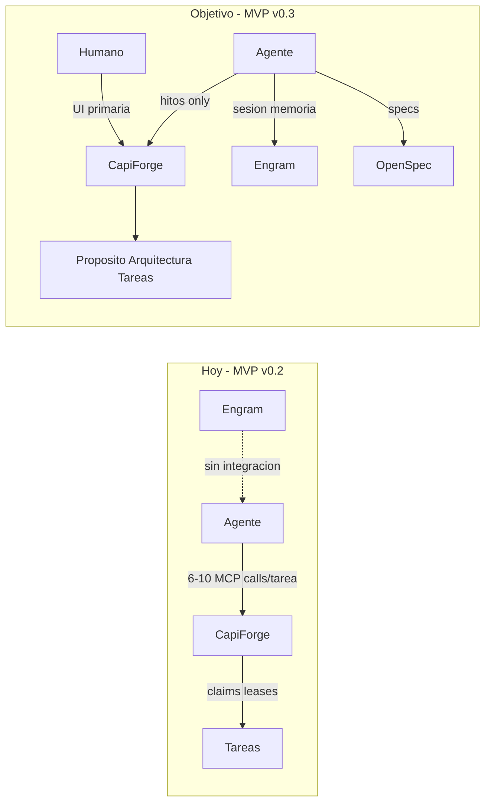
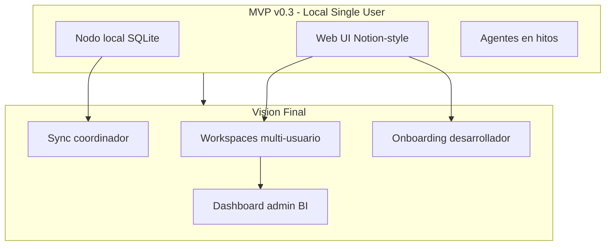
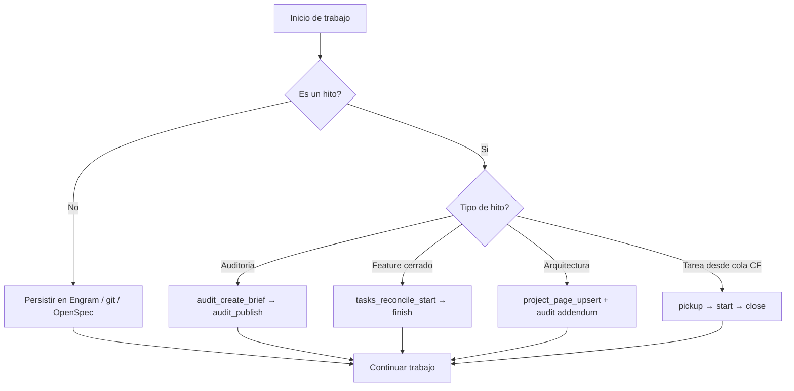

# Auditoría: CapiForge v0.3 — Pivot a hub de documentación y tareas

> **Actualizado:** la fase de **cierre, verificación y release** vive en [audit-v03-mvp-closure.md](audit-v03-mvp-closure.md) (`aud_365b26538f135fdb` en CapiForge). Este documento conserva el análisis de pivot original (`aud_520ca02978e35b95`, superseded).

**Fecha:** 2026-06-21  
**Alcance:** reescalado del objetivo MVP, comparación estado actual vs visión final, gaps y plan de tareas  
**Objetivo:** pivotar de orquestador de agentes a repositorio vivo del proyecto (documentación + tareas), local-first, IA-first, sin competir con Engram ni OpenSpec.

## Resumen ejecutivo

El MVP de coordinación owner-local ([audit-v02](audit-v02-mvp-status.md)) está **cerrado al 100%** para su objetivo original: agentes que reclaman, inician y cierran tareas vía MCP con claims exclusivos.

El **nuevo objetivo** cambia el producto de *orquestador de agentes* a *repositorio vivo del proyecto* — documentación (propósito, arquitectura), tareas y su estado — con interfaz amigable tipo Notion, **local-first**, **IA-first**, y **sin competir con Engram ni OpenSpec** en persistencia de sesión o specs.

**Decisiones confirmadas:**

- **Fuente de verdad híbrida:** propósito, arquitectura y tareas en CapiForge (SQLite); specs y memoria de agente en repo/Engram.
- **Touchpoints de agente:** solo en **hitos** (auditorías, cierre de features, cambios de arquitectura) — no por micro-tarea.

---

## 1. Estado actual (línea base)

### Qué existe y funciona

| Área | Estado | Evidencia |
|------|--------|-----------|
| Runtime owner-local | Completo | [architecture-v01.md](../architecture-v01.md), 256 tests |
| MCP (14 tools) | Completo | `runtime/node/mcp_stdio.py` |
| Skills (5) | Completo | `skills/`, instalados vía `capinstall` |
| SQLite schema | Beta-ready | `storage/node-schema.sql` |
| Web UI Notion-style | Parcial | `runtime/web/` — dashboard, tareas, viewer de auditorías |
| TUI | Completo | `runtime/tui/` |
| Coordinator LAN | Implementado, no requerido | `runtime/coordinator/` |

**Estado vivo del proyecto (dogfooding, 2026-06-21):**

- `bootstrap_state: adopted`, 11 auditorías publicadas, 44 tareas `done`, 0 `ready`, 5 `expired_claim`
- Cola vacía — coherente con MVP de coordinación cerrado, no con hub documental activo

### Posicionamiento actual vs deseado



### Coste de tokens hoy (problema central)

Flujo actual **obligatorio por tarea** (skills pickup → start → close):

| Fase | MCP calls típicos |
|------|-------------------|
| Pickup | `current_get` + `tasks_ready_get` + `tasks_claim` = **3** |
| Start | `current_get` + `tasks_transition` = **2** |
| Close | `current_get` + `tasks_transition` = **2** |
| Renovación (trabajo largo) | `tasks_claim_renew` cada 3-4 min |
| **Total mínimo por tarea** | **7 calls** + payloads JSON completos |

Path B (trabajo nuevo): `audit_create_brief` + `audit_publish` + `tasks_reconcile_start` + `tasks_reconcile_finish` = **4 calls** adicionales.

Con múltiples agentes y decenas de micro-tareas por sesión, esto escala linealmente en tokens — **conflicto directo** con el nuevo objetivo.

---

## 2. Nuevo MVP reescalado (v0.3)

### Definición

> **CapiForge MVP v0.3** = hub local, single-user, multi-agente, que mantiene actualizada la documentación del proyecto (propósito, arquitectura) y el estado de las tareas, con UI tipo Notion como superficie primaria de consumo humano. Los agentes publican **solo en hitos**, con formatos predefinidos. Engram y OpenSpec siguen siendo canónicos para memoria de sesión y specs.

### Alcance IN

- Documentación estructurada del proyecto en SQLite: **propósito**, **arquitectura**, **auditorías** (ya existe), **tareas** (ya existe)
- UI web como superficie primaria: lectura + edición humana de docs y tareas
- Contrato de publicación IA-first documentado en skills (cuándo, formato, qué NO publicar)
- Flujos MCP existentes **preservados** pero **no obligatorios por micro-tarea**
- Local-first, un usuario, varios agentes sobre el mismo proyecto adoptado
- Dogfooding: este repo usa CapiForge para su propia auditoría v0.3 y plan de tareas

### Alcance OUT (MVP v0.3)

- Competir con Engram en memoria persistente de sesión
- Sincronización multi-máquina / multi-usuario (visión final)
- Dashboards BI / admin cross-project (visión final)
- Claims obligatorios para actualizaciones documentales
- Block editor Notion completo
- Embeddings / búsqueda semántica

### Modelo de fuentes de verdad (híbrido)

| Contenido | Canónico en | CapiForge rol |
|-----------|-------------|---------------|
| Propósito del proyecto | CapiForge | Escritura humana + hitos de agente |
| Arquitectura viva | CapiForge | Escritura humana + hitos de agente |
| Auditorías / informes | CapiForge | `audit_create_brief` → `audit_publish` en hitos |
| Tareas y estado | CapiForge | Creación en hitos; UI para seguimiento humano |
| Specs (OpenSpec) | Repo `openspec/` | Referencia vía `artifact_refs` / links |
| Memoria de agente | Engram | Sin duplicar; skill indica "no publicar en CF" |
| Docs técnicos largos | Repo `docs/` | `local_documents` como índice de rutas (ya existe) |

### Contrato de publicación para agentes (nuevo)

Los agentes **NO** deben ejecutar pickup/start/close por cada micro-tarea. Solo publican en hitos:

| Hito | Acción CapiForge | Formato |
|------|------------------|---------|
| Auditoría / revisión completada | `audit_create_brief` → `audit_publish` | Markdown en `audits.content` |
| Feature o cambio significativo cerrado | `tasks_reconcile_start` → `tasks_reconcile_finish` o transición batch | Metadatos `done_*` obligatorios |
| Cambio de arquitectura | Actualizar doc de arquitectura (nuevo MCP o UI) + auditoría de addendum | Markdown estructurado |
| Micro-tarea, fix menor, exploración | **Nada en CapiForge** | Engram / git / OpenSpec |

**Flujos existentes se respetan** cuando el hito lo amerita; el cambio es de **cadencia**, no de protocolo.

---

## 3. Visión final del producto (post-MVP)



| Capacidad | MVP v0.3 | Visión final |
|-----------|----------|--------------|
| Usuarios | 1 owner local | Invitar a workspaces |
| Proyectos | 1 adoptado por nodo (schema soporta más) | Multi-proyecto por workspace |
| UI | Web local 127.0.0.1 | Web accesible + permisos |
| Agentes | Publican en hitos | Mismo contrato, más proyectos |
| Sync | No | Coordinador LAN + delta firmado |
| Onboarding | Manual via UI/docs | Repo vivo auto-generado |
| BI | Queue counts básicos | Dashboards, gráficos, avance por proyecto |

Infraestructura ya construida para visión final (no reutilizar en MVP): `storage/coordinator-schema.sql`, enrollment, `cross_project_approvals`, `project_links`.

---

## 4. Gap analysis detallado

### G1 — Visión y documentación de producto (CRÍTICO)

| Gap | Estado actual | Necesario |
|-----|---------------|-----------|
| Definición MVP v0.3 | No existe; `docs/mvp.md` describe coordinación v0.2 | Reescribir `docs/mvp.md` o crear `docs/mvp-v03.md` |
| Posicionamiento vs Engram | Solo mención en OpenSpec archive | Sección explícita en architecture + AGENTS.md |
| Contrato de publicación | Skills asumen ciclo completo por tarea | Nuevo skill `capiforge-publish-milestone` |
| Auditoría v0.3 | No publicada | Este documento |

### G2 — Modelo de documentación (ALTO)

| Gap | Estado actual | Necesario |
|-----|---------------|-----------|
| Campo "propósito" del proyecto | No existe en schema; solo `projects.name` | Nueva entidad `project_pages` (tipo: purpose, architecture) |
| Página de onboarding | No existe en UI | Ruta `/project` o sección home con propósito + links |
| Edición de docs en UI | Solo lectura de auditorías | Editor markdown para páginas de proyecto |
| `local_documents` | Índice de rutas, sin viewer | Viewer de archivos repo referenciados |
| Sincronización repo ↔ CF | Manual | Indexador opcional de `docs/` → refs (no canónico) |

Schema actual relevante (`storage/node-schema.sql`):

```sql
CREATE TABLE project_entrypoints (
  project_id TEXT PRIMARY KEY REFERENCES projects(project_id) ON DELETE CASCADE,
  owner_node_id TEXT NOT NULL,
  summary_json TEXT NOT NULL,
  ...
);
```

`summary_json` podría albergar propósito corto, pero no sustituye páginas editables.

### G3 — UI web (ALTO)

| Componente | Estado | Gap |
|------------|--------|-----|
| Dashboard home | Básico (queue counts) | Falta propósito, arquitectura resumida, onboarding |
| Tareas | Tabla con filtros, claim/transition | OK para MVP; falta creación humana de tareas |
| Docs | Viewer de auditorías | Falta páginas de proyecto editables |
| Sidebar | Workspace/proyecto | OK |
| Idioma | UI en español, skills en inglés | Política mix documentada; no bloquear MVP |

### G4 — Superficie MCP y token efficiency (MEDIO-ALTO)

| Gap | Propuesta |
|-----|-----------|
| 7+ calls por tarea obligatoria | Deprecar obligatoriedad en skills; hitos only |
| Sin operación batch | Nuevo tool `milestone_publish` (audit + tasks en 1 call) — opcional v0.3 |
| Sin CRUD de páginas de proyecto | Nuevo tool `project_page_upsert` o human-only vía UI |
| Skills desalineados | Reescribir pickup/start/close como **opcionales**; nuevo skill de hitos |

Herramientas actuales a **mantener** sin breaking changes: las 14 existentes.

### G5 — Skills y AGENTS.md (MEDIO)

| Skill actual | Cambio propuesto |
|--------------|------------------|
| `capiforge-pickup-task` | Marcar como "solo cuando orquestador asigna trabajo desde cola CF" |
| `capiforge-start-task` | Idem |
| `capiforge-close-task` | Idem |
| `capiforge-record-completed-work` | Adaptar a hitos (ya cercano al modelo deseado) |
| `capiforge-data-layer` | Añadir tabla de fuentes de verdad híbridas |
| **Nuevo:** `capiforge-publish-milestone` | Contrato: cuándo publicar, formatos, qué evitar |

### G6 — Multi-proyecto y workspace (BAJO para MVP)

- Schema soporta `workspaces` + `projects` múltiples
- Bootstrap V1.1 adopta **un solo repo** por nodo
- UI lista workspaces pero operación es single-adopted
- **MVP v0.3:** mantener single-project; documentar extensión futura

### G7 — Visión final: multi-usuario, sync, BI (FUERA DE MVP)

Ya construido pero no priorizar:

- Coordinator enrollment, `sync_status`, delta exchange
- `cross_project_approvals`, `project_links`
- No hay UI de admin ni métricas BI

---

## 5. Qué conservar sin cambios

- SQLite schema base (audits, tasks, claims) — extender, no reemplazar
- Flujos Path A y Path B — válidos para hitos
- `capinstall` + MCP wiring
- Web UI foundation (notion.css, templates, HTMX API)
- Tests existentes como regression gate
- Local-first, `bootstrap.json` + `node.sqlite3` bajo `.capiforge/node/`

---

## 6. Qué deprecar o rebajar prioridad

| Elemento | Acción |
|----------|--------|
| Ciclo pickup→start→close obligatorio por tarea | Rebajar a opcional en docs/skills |
| Claims para actualizaciones documentales | No requerir claim para editar docs |
| Coordinator LAN en roadmap MVP | Mantener congelado |
| Objetivo "coordinación multi-agente" como north star | Reemplazar por "hub documental del proyecto" |
| Auto-seed de tareas al publicar auditoría | Mantener manual/scripts; no auto en publish |

---

## 7. Plan de tareas derivadas (para CapiForge)

Publicar como **auditoría v0.3** y sembrar tareas con `lifecycle_key` bajo `audit/v0.3/*`.

### Fase 0 — Auditoría y alineación

| lifecycle_key | Prioridad | Descripción |
|---------------|-----------|-------------|
| `audit/v0.3/scope-pivot-audit` | critical | Publicar auditoría v0.3 (este documento) en CF |
| `audit/v0.3/vision-docs` | high | Reescribir visión: mvp.md, architecture-v01, AGENTS.md con pivot |
| `audit/v0.3/engram-boundary` | high | Documentar límites CapiForge vs Engram vs OpenSpec |

### Fase 1 — Contrato de publicación (IA-first, token-efficient)

| lifecycle_key | Prioridad | Descripción |
|---------------|-----------|-------------|
| `audit/v0.3/skill-publish-milestone` | critical | Crear skill `capiforge-publish-milestone` |
| `audit/v0.3/skills-realign` | high | Actualizar skills existentes: hitos vs ciclo por tarea |
| `audit/v0.3/agents-decision-tree` | medium | Actualizar AGENTS.md con nuevo árbol de decisiones |

### Fase 2 — Modelo de documentación

| lifecycle_key | Prioridad | Descripción |
|---------------|-----------|-------------|
| `audit/v0.3/schema-project-pages` | high | Diseño + migración: `project_pages` (purpose, architecture, custom) |
| `audit/v0.3/mcp-project-pages` | medium | MCP read/upsert de páginas de proyecto (o UI-only MVP) |
| `audit/v0.3/seed-project-docs` | medium | Sembrar propósito y arquitectura de CapiForge en páginas |

### Fase 3 — UI hub documental

| lifecycle_key | Prioridad | Descripción |
|---------------|-----------|-------------|
| `audit/v0.3/ui-project-home` | high | Página home/onboarding con propósito + arquitectura + estado |
| `audit/v0.3/ui-doc-editor` | high | Editor markdown para páginas de proyecto |
| `audit/v0.3/ui-task-create` | medium | Creación humana de tareas desde UI |
| `audit/v0.3/ui-local-docs-viewer` | low | Viewer de `local_documents` referenciados |

### Fase 4 — Eficiencia MCP (opcional en v0.3)

| lifecycle_key | Prioridad | Descripción |
|---------------|-----------|-------------|
| `audit/v0.3/mcp-milestone-batch` | medium | Tool `milestone_publish` (audit + task closure en 1 call) |
| `audit/v0.3/mvp-checklist-v03` | medium | Nuevo checklist de aceptación MVP v0.3 |

### Fase 5 — Visión final (backlog explícito, no MVP)

| lifecycle_key | Prioridad | Descripción |
|---------------|-----------|-------------|
| `audit/future/multi-user-workspaces` | low | Diseño invitaciones y permisos |
| `audit/future/sync-coordinator` | low | Activar sync multi-máquina |
| `audit/future/admin-dashboards` | low | BI cross-project |

---

## 8. Nuevo árbol de decisiones para agentes (propuesto)



---

## 9. Criterios de aceptación MVP v0.3

1. Humano abre `capiforge web` y ve **propósito**, **arquitectura**, **tareas** y **auditorías** actualizados
2. Agente con skill de hitos publica una auditoría **sin** ciclo pickup/start/close
3. Documentación explícita de límites con Engram y OpenSpec
4. Flujos MCP v0.2 siguen funcionando (regression tests verdes)
5. Dogfooding: auditoría v0.3 y tareas de fase 0-3 trackeadas en CapiForge
6. Reducción medible: hito típico ≤ 3 MCP calls (vs 7+ por micro-tarea)

---

## 10. Riesgos

| Riesgo | Mitigación |
|--------|------------|
| Agentes siguen usando ciclo completo por inercia de skills | Skill nuevo prominente; deprecación explícita en skills viejos |
| Duplicación CF ↔ Engram | Tabla de fuentes de verdad en data-layer skill |
| Scope creep hacia Notion completo | MVP limitado a markdown pages + task table |
| Schema migration en proyectos adoptados | Migración incremental con `PRAGMA user_version` |
| UI español / docs inglés | Política documentada; no bloquear MVP |

---

## 11. Próximo paso inmediato (dogfooding)

1. Publicar esta auditoría vía `audit_create_brief` → `audit_publish` (MCP/CLI)
2. Sembrar tareas fase 0-3 con `scripts/seed_audit_v03_tasks.py`
3. Ejecutar `audit/v0.3/vision-docs` como primera tarea de implementación
