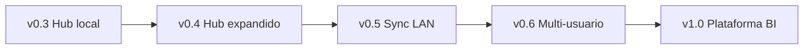

# Audit: CapiForge v0.4 — Expanded hub and platform foundations

**Date:** 2026-06-21  
**Builds on:** [audit-v03-mvp-closure.md](audit-v03-mvp-closure.md), [audit-v03-scope-pivot.md](audit-v03-scope-pivot.md)  
**Scope:** multi-project web hub, developer onboarding, docs indexer, platform RFCs, release gate  
**Goal:** bridge v0.3 local hub to final vision (multi-user, sync, BI) without activating coordinator sync or invitations yet

> v0.3 is **closed** (tag `v0.3.0`, baseline in [mvp-v03-baseline.md](../mvp-v03-baseline.md)). This audit defines v0.4.

## Executive summary

MVP v0.3 delivered a **local single-repo documentation and task hub**. v0.4 extends that hub to **multiple adopted projects per workspace**, adds **developer onboarding** and a **`docs/` indexer**, publishes **platform RFCs** for v0.5+, and supersedes the stale `audit/future/*` backlog.

**Confirmed decision:** product-first hub expansion; sync LAN and multi-user implementation deferred to v0.5/v0.6.

## v0.3 baseline

| Metric | Value |
|--------|-------|
| `audit/v0.3/*` tasks | 24/24 done |
| Git tag | `v0.3.0` |
| MCP tools | 17 (incl. `milestone_publish`, `project_page_get`, `project_page_upsert`) |
| Web hub | purpose, architecture, tasks, audits, task create, local docs viewer |
| Remaining `ready` before this audit | 3 × `audit/future/*` (design backlog) |

## Roadmap v0.3 → v1.0

## v0.4 scope

### IN

- Multi-project navigation and registry hardening in web UI
- Developer onboarding section in hub
- `docs/**/*.md` → `local_documents` indexer script
- Architecture / AGENTS / `mvp-v04.md` alignment (17 MCP tools)
- Platform RFCs (sync, multi-user, admin BI) — design only
- Optional release gate and tag `v0.4.0`

### OUT

- Coordinator sync activation in production
- Multi-user workspace invitations
- Implemented admin dashboards / BI
- Block editor Notion, semantic search, embeddings
- Breaking MCP changes for v0.2/v0.3 flows

## Gap analysis v0.3 → v0.4

| Area | v0.3 state | v0.4 target |
|------|------------|-------------|
| Multi-project | adopt-folder + registry exist; switching awkward | Project switcher; stable registry CRUD |
| Onboarding | README + demo-v03 only | Onboarding block in web hub |
| `local_documents` | Manual insert; viewer exists | Indexer script for `docs/` |
| Architecture docs | Says 14 MCP tools | Document 17 tools + v0.4 status |
| `audit/future/*` | 3 stale ready tasks | Superseded by v0.4 RFC tasks |
| Coordinator | Frozen | RFC only; no activation |

## Derived tasks (`audit/v0.4/*`)

### Phase 0 — Alignment

| lifecycle_key | Priority | Description |
|---------------|----------|-------------|
| `audit/v0.4/scope-audit` | critical | Publish this audit in repo and CapiForge |
| `audit/v0.4/architecture-update` | high | Update architecture-v01, AGENTS.md, create mvp-v04.md |
| `audit/v0.4/supersede-future-tasks` | medium | Cancel/close audit/future/* with RFC references |

### Phase 1 — Multi-project hub

| lifecycle_key | Priority | Description |
|---------------|----------|-------------|
| `audit/v0.4/multi-project-switcher` | high | Web navigation between adopted projects in a workspace |
| `audit/v0.4/multi-project-registry-hardening` | high | Harden project-repos.json + per-project paths + tests |
| `audit/v0.4/multi-project-entrypoint` | medium | Home/header reflects active project; document MCP vs web registry |

### Phase 2 — Onboarding and indexed docs

| lifecycle_key | Priority | Description |
|---------------|----------|-------------|
| `audit/v0.4/onboarding-hub-page` | high | Web onboarding: install, skills, milestone contract, demo links |
| `audit/v0.4/docs-indexer` | medium | Script indexing docs/**/*.md into local_documents |
| `audit/v0.4/demo-v04` | medium | Updated 5-minute demo script for v0.4 |

### Phase 3 — Platform RFCs (supersedes audit/future/*)

| lifecycle_key | Priority | Supersedes | Deliverable |
|---------------|----------|------------|-------------|
| `audit/v0.4/rfc-sync-coordinator` | medium | `audit/future/sync-coordinator` | docs/rfcs/rfc-sync-coordinator-v05.md |
| `audit/v0.4/rfc-multi-user-workspaces` | medium | `audit/future/multi-user-workspaces` | docs/rfcs/rfc-multi-user-v06.md |
| `audit/v0.4/rfc-admin-dashboards` | low | `audit/future/admin-dashboards` | docs/rfcs/rfc-admin-bi-v10.md |

### Phase 4 — Release gate

| lifecycle_key | Priority | Description |
|---------------|----------|-------------|
| `audit/v0.4/release/baseline-checklist` | high | Manual pass/fail vs mvp-v04.md |
| `audit/v0.4/release/full-test-suite` | critical | Full unittest suite green |
| `audit/v0.4/release/version-bump` | high | 0.4.0 in pyproject + debian/changelog |
| `audit/v0.4/release/git-tag-v040` | high | Annotated tag v0.4.0 after green gate |

## Superseding audit/future/*

| Old lifecycle_key | Replaced by |
|-------------------|-------------|
| `audit/future/sync-coordinator` | `audit/v0.4/rfc-sync-coordinator` |
| `audit/future/multi-user-workspaces` | `audit/v0.4/rfc-multi-user-workspaces` |
| `audit/future/admin-dashboards` | `audit/v0.4/rfc-admin-dashboards` |

Close old tasks as `cancelled` with `done_references` pointing to the v0.4 RFC lifecycle_key.

## v0.4 success criteria

| # | Criterion |
|---|-----------|
| P1 | 2+ adopted projects navigable in web |
| P2 | Onboarding visible from hub without README |
| P3 | `docs/` indexable and visible in Documentación |
| P4 | 3 platform RFCs published; audit/future/* closed |
| R1 | unittest suite green |
| R2 | capinstall verify OK |
| R3 | (Optional) git tag v0.4.0 |

## Recommended execution order

1. Phase 0 — alignment + supersede future
2. Phase 1 — multi-project (highest product value)
3. Phase 2 — onboarding + docs indexer
4. Phase 3 — RFCs in parallel
5. Phase 4 — release gate

## References

- [architecture-v01.md](../architecture-v01.md)
- [mvp-v03-baseline.md](../mvp-v03-baseline.md)
- [mvp-v04.md](../mvp-v04.md)
- [runtime/web/project_registry.py](../../runtime/web/project_registry.py)
