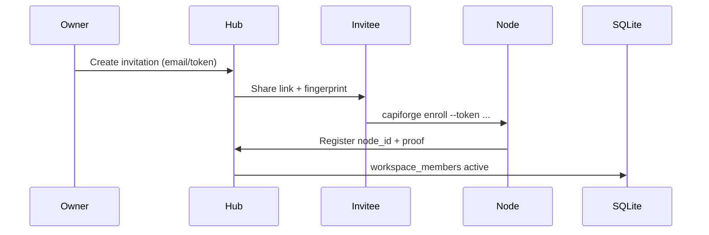

# RFC: Multi-user workspaces (v0.6)

**Status:** draft  
**Supersedes:** `audit/future/multi-user-workspaces`  
**Lifecycle key:** `audit/v0.4/rfc-multi-user-workspaces`

## Problem

v0.4–v0.5 assume a **single owner** with multiple machines. The enrollment schema exists but there is no invitation flow, role model, or human UI for shared workspaces.

## Goals

- Invite additional humans to a workspace with explicit roles.
- Keep SQLite local-first; no cloud account requirement for MVP of multi-user.
- Agents remain scoped to owner-approved projects.

## Non-goals

- Public SaaS hosting.
- Fine-grained ACL per task field.
- SSO/OAuth in first slice.

## Roles (v0.6 minimum)

| Role | Capabilities |
| --- | --- |
| `owner` | Adopt repos, invite, revoke, all mutations |
| `contributor` | Claim/transition tasks, publish audits on assigned projects |
| `viewer` | Read web hub + MCP reads only |

Roles stored in new `workspace_members` table (enrollment schema extension).

## Invitation flow

Reuse `enrollment` tables where possible; add `invitation_expires_at` and one-time tokens.

## MCP boundary

- `current_get` remains scoped to the node's adopted context.
- Cross-member reads use `project_entrypoint_get` with membership check in store.
- Writes require `contributor+` on project.

## v0.6 derived tasks

| Task | Deliverable |
| --- | --- |
| `audit/v0.6/schema-workspace-members` | Migration + store APIs |
| `audit/v0.6/web-invitations` | Invite/revoke UI on hub |
| `audit/v0.6/mcp-membership-guard` | Deny mutations for viewers |
| `audit/v0.6/enroll-cli` | Human enrollment command |

## Security notes

- Invitation tokens hashed at rest.
- Node proof (`derive_node_proof`) required for agent sessions.
- No automatic cross-workspace project linking without owner approval (existing `project_links`).

## Rollback

Single-owner mode remains default when `workspace_members` count = 1.
